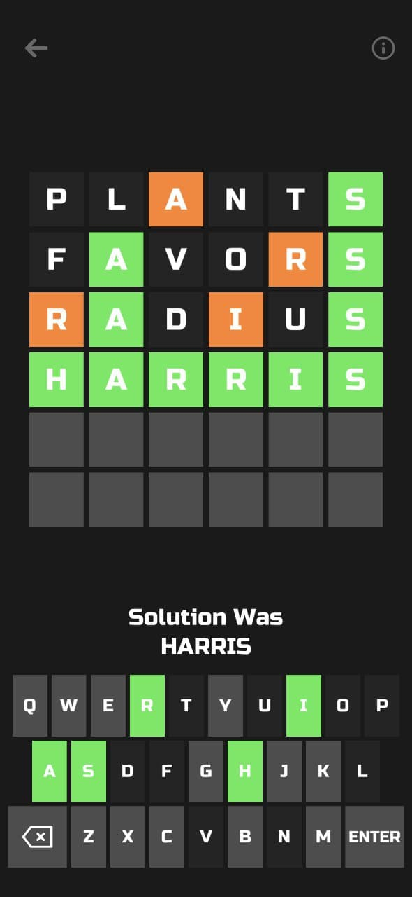

# wordle-solver
A simple python program to solve the puzzle game Wordle


## Usage
This program searches a large english dictionary and returns all possible words that match the patterns

For each guessed word, follow the prompts:

```
Enter your guessed word.
:

Enter Wordle's response: 'g' for green; 'o' for orange; '.' for blank. eg o.oo..og
:
```

Codex

    'g': green/correct letter.
    'o': orange/displaced letter.
    '.': gray/blank letter.

Our dictionary is much larger than the one used by the current version of Wordle. Sometimes, possible words are not found in Wordle's dictionary. 


Example



1. Your first guess is "PLANTS". Wordle responds with an 'a' as an orange/displaced letter, 's' as a correct/green letter, and every other letter as gray/blank. Enter this in the format described. In this case, `"..o..g"` and press enter. 

```
Enter your guessed word.
: plants

Enter Wordle's response: 'g' for green; 'o' for orange; '.' for blank. eg o.oo..og
: ..o..g
```

The program finds 567 possible words. We need to narrow it down further. Input a word from the list supplied, or one of your choosing.

2. You decide to enter "FAVORS". Wordle responds with 'a' and 's' as a correct/green letter, these will be `'g'` in their corresponding positions. Wordle gives 'r' as an orange/displaced letter, this will be represented with an `'o'`. The rest are blank and will be represented with a `'.'`

```
Enter your guessed word.
: favors

Enter Wordle's response: 'g' for green; 'o' for orange; '.' for blank. eg o.oo..og
: .g..og
```

This narrows it down to 63 possible words. Let's try again.

3. You guess "RADIUS" from the possible 63 given to you.

```
Enter your guessed word.
: radius

Enter Wordle's response: 'g' for green; 'o' for orange; '.' for blank. eg o.oo..og
: og.o.g
```

This narrows it down to 4 possible words:

    markis
    zaires
    harris
    marais

Our dictionary is much larger than the one used by the current version of Wordle. Try to guess the most common word. In this case "harris".

Solved. 